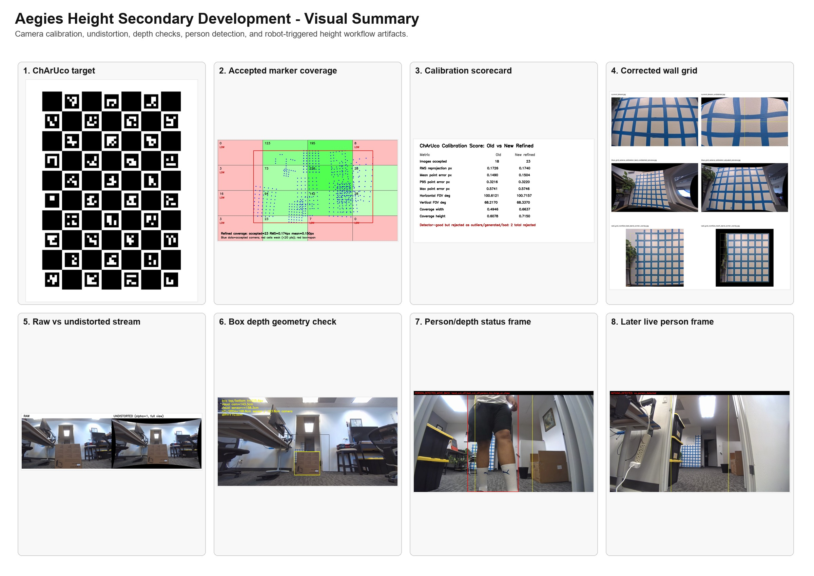
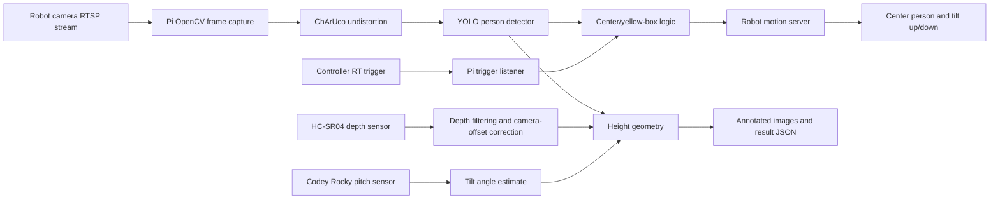
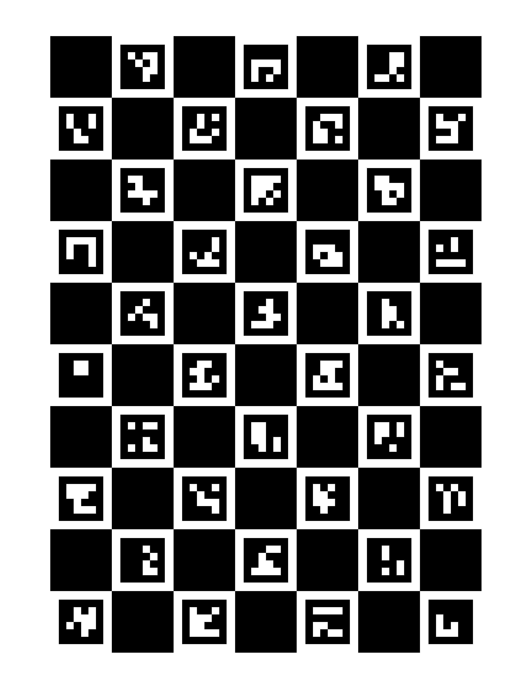
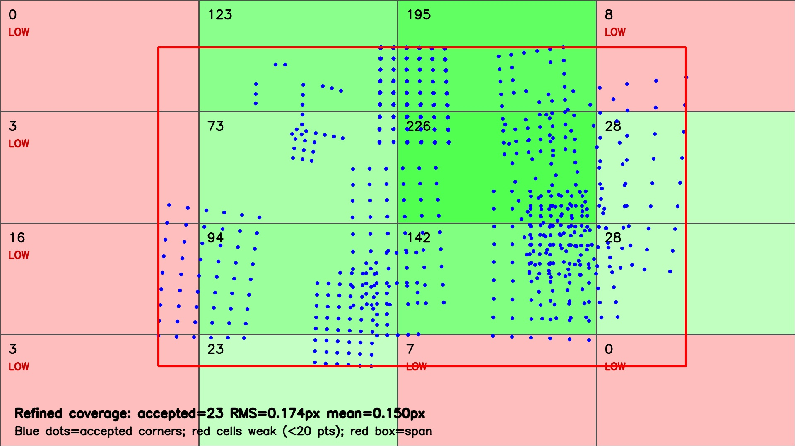
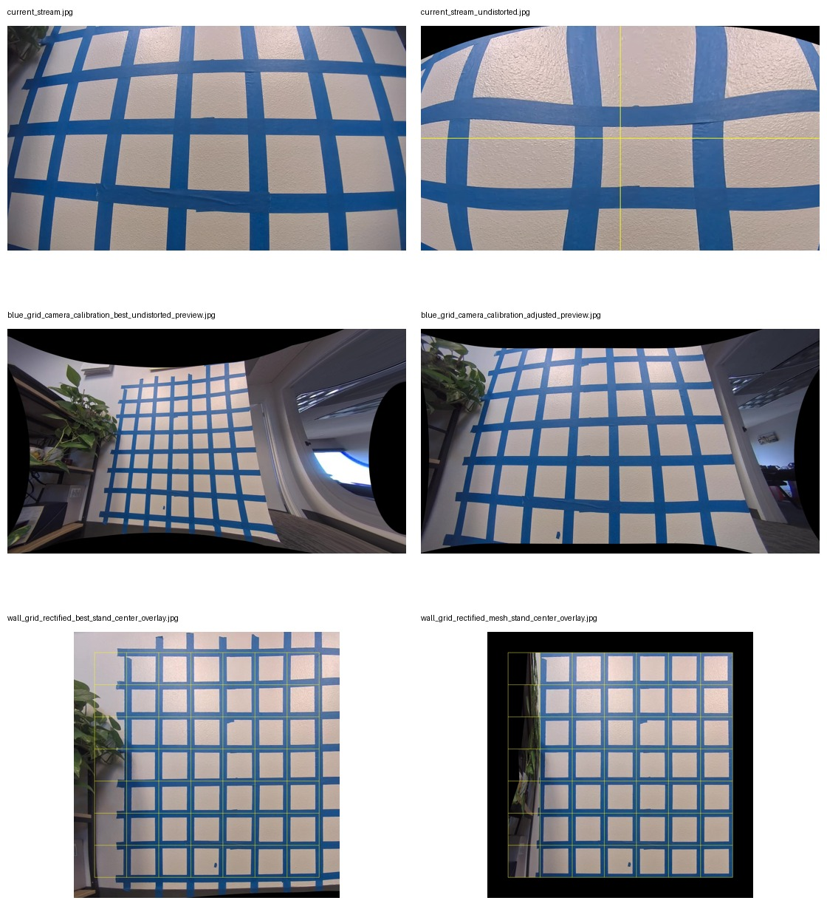
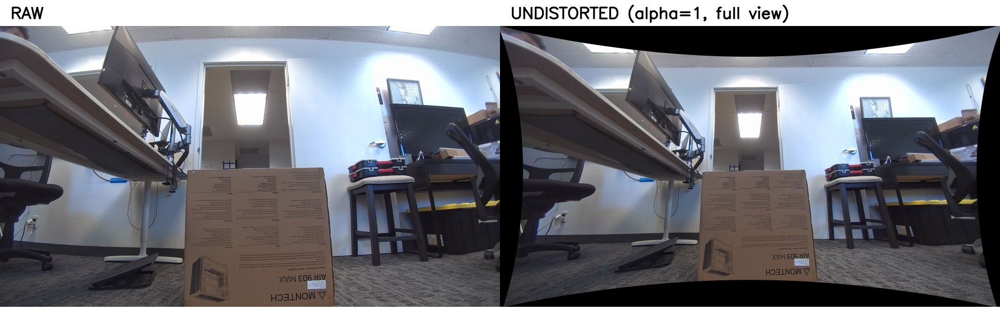
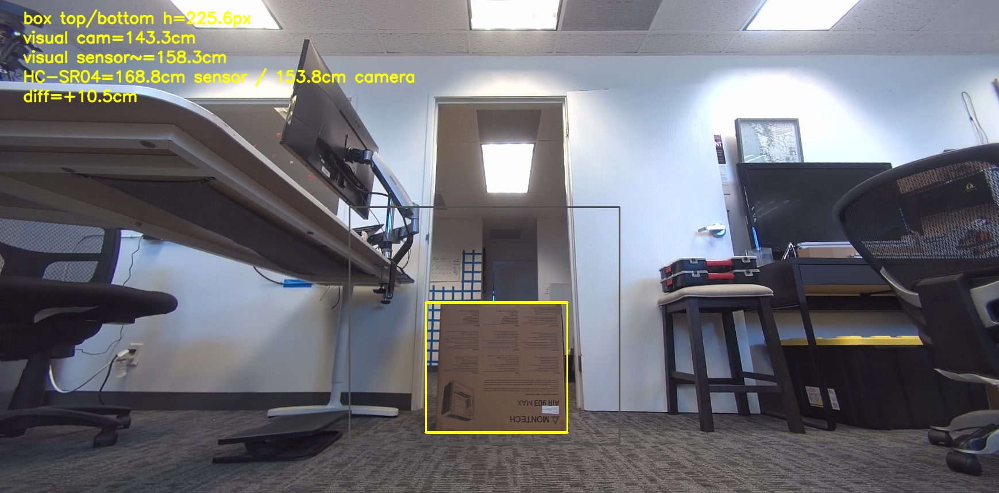
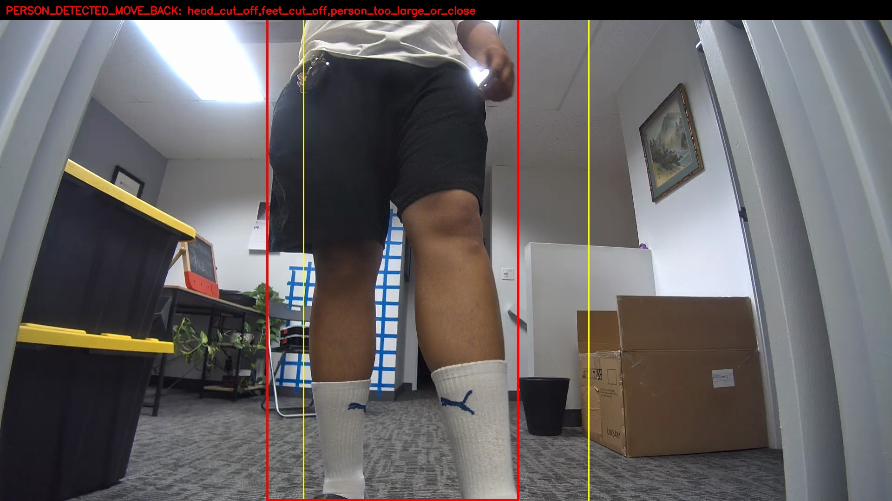

# Aegies Height Secondary Development Guide

This document describes what we built, why it counts as secondary development,
and how to repeat the same process with another robot dog, another camera, or
another mounted sensor package.

The short version:

```text
Robot camera + OpenCV calibration
+ YOLO person detection
+ HC-SR04 distance sensor
+ Codey/IMU pitch angle
+ robot motion/tilt control
= automatic height-estimation pipeline
```

This is secondary development because we did not only run the vendor robot as a
finished product. We added a Raspberry Pi, external sensors, camera calibration,
human detection, robot-motion logic, depth filtering, pitch measurement,
capture automation, and a future dashboard workflow on top of the robot SDK and
camera stream.

## Visual Summary

This contact sheet shows the whole project path in one place: the calibration
target, accepted ChArUco coverage, scorecard, corrected wall grid, undistorted
camera stream, box/depth check, and human-detection outputs.



The important thing to understand from these images is:

```text
ChArUco board -> camera matrix and distortion coefficients
coverage map -> where the calibration is strong/weak
rectified grid -> visual proof that distortion correction works
raw vs undistorted stream -> what the correction does to real robot frames
box overlay -> physical geometry/depth sanity check
human overlay -> YOLO person detection + center/depth status
```

## Final Goal

The target product behavior is:

1. The robot is powered on and put into standing mode.
2. The Pi connects to the robot network and opens the robot camera stream.
3. The system learns the background/empty scene.
4. When RT is pressed on the controller, the Pi checks the camera image.
5. If a person is inside the large allowed yellow box, the robot centers them.
6. The robot stays standing. It does not go into damping mode.
7. The robot tilts up, pauses, captures an image.
8. The robot returns neutral, tilts down, pauses, captures another image.
9. The system reads depth, reads pitch, detects head/feet, and estimates height.
10. The output is saved as annotated images plus machine-readable JSON/JSONL.

The core idea is geometry:

```text
height_cm = distance_cm * (tan(head_angle) - tan(foot_angle))
```

The difficult part is making `distance_cm`, `head_angle`, and `foot_angle`
refer to the same real person, not the wall, floor, box, door, or side objects.

## System Architecture



## Image Artifact Index

These are the images worth keeping and showing when explaining the project:

| Image | What It Shows | Why It Matters |
| --- | --- | --- |
| `docs/images/secondary_development/visual_summary.jpg` | One-page visual summary of the whole project. | Fastest way to explain what we built. |
| `calibration_targets/charuco_7x10_25mm_18mm_4x4_50_letter_300dpi.png` | The ChArUco board used for calibration. | Defines the known pattern OpenCV solves from. |
| `docs/images/secondary_development/charuco_coverage_refined.jpg` | Accepted calibration corner coverage. | Shows whether the calibration sees enough of the camera frame. |
| `docs/images/secondary_development/old_vs_new_refined_scorecard.jpg` | Old vs refined calibration score. | Proves the final ChArUco run improved the model. |
| `docs/images/secondary_development/corrected_views_contact_sheet.jpg` | Corrected wall-grid views. | Visual proof that distortion correction straightens useful geometry. |
| `docs/images/secondary_development/robot_stream_raw_vs_undistorted.jpg` | Robot stream before/after undistortion. | Shows how real frames change after calibration. |
| `docs/images/secondary_development/box_edge_distance_overlay.jpg` | Known box and edge/depth check. | Connects image geometry to a real measured object. |
| `docs/images/secondary_development/human_height_0025_annotated.jpg` | Human detection/status overlay. | Shows person box, allowed yellow area, and decision text. |

## Hardware We Used

| Part | Role |
| --- | --- |
| Robot dog | Provides the wide-angle camera, body motion, standing posture, and tilt/pose control. |
| Raspberry Pi | Runs the height code, OpenCV, YOLO, depth sensor, pitch reader, trigger logic, and dashboard. |
| HC-SR04 ultrasonic sensor | Measures forward distance. It cannot classify humans by itself. |
| Codey Rocky | External pitch sensor over USB serial so we can measure real dog tilt angle. |
| Xbox-like controller | RT trigger starts the automatic capture sequence. |
| ChArUco board on iPad | Used for camera calibration without printing. |
| Green screen/background | Reduced visual noise while collecting calibration images. |
| Known-height box | Used to sanity-check camera pose, depth, and undistortion. Latest box height used: `54 cm`. |

Current measured sensor mounting offsets:

```text
HC-SR04 is about 12 cm behind the robot camera lens.
HC-SR04 is about 12 cm above the robot camera lens.
```

The software corrects this with:

```text
camera_distance_cm = sqrt(sensor_distance_cm^2 - above_cm^2) - behind_cm
```

This corrects forward/back and vertical offset. It does not fix left/right
misalignment. The sensor still needs to physically point at the person.

## Network Setup

The working lab setup used two network paths:

```text
Windows <-> Pi Ethernet:
  Windows: 10.10.10.1
  Pi eth0: 10.10.10.2

Pi <-> Robot network:
  Robot: 192.168.234.1
  Pi wlan0: usually 192.168.234.x
  Robot camera: rtsp://192.168.234.1:8554/test
```

This lets Windows SSH into the Pi while the Pi talks to the robot camera and
robot SDK path.

Important commands:

```bash
ip -4 addr show eth0
ip -4 addr show wlan0
hostname -I
```

The phone/mobile version should run a Pi dashboard and connect the phone to the
same network as the Pi dashboard. See:

```text
docs/pi_mobile_dashboard.md
scripts/pi_height_dashboard.py
```

## What We Did, Stage By Stage

### 1. First Laser/Grid Calibration Attempt

We first tried to teach OpenCV how the dog camera sees using:

```text
blue tape wall grid
green laser dot
OpenCV detection
manual box labels
camera_calibration.json
```

This produced a useful early FOV estimate:

```text
horizontal FOV: about 53.5 deg
vertical FOV: about 32.5 deg
best laser average error: about 7.8 px
best laser max error: about 16 px
```

But it was not reliable enough for final height estimation because:

```text
wide-angle dog camera
tiny laser dot
manual labels
dark/noisy images
camera stream lag/timeouts
one wall position
limited edge/top/bottom coverage
real-world pitch/level changes
```

The laser/grid work is still useful as history and debugging, but it is not the
main path now.

Relevant files:

```text
examples/vision/grid_laser_calibration.py
docs/camera_height_workflow.md
docs/accepted_laser_images_cleanup.md
camera_calibration_runs/
```

### 2. ChArUco Camera Calibration

We then moved to ChArUco calibration because it is the correct OpenCV method for
wide-angle camera intrinsics and distortion.

The generated target is here:



Files:

```text
calibration_targets/charuco_7x10_25mm_18mm_4x4_50_letter_300dpi.png
calibration_targets/charuco_7x10_25mm_18mm_4x4_50_letter_300dpi.pdf
calibration_targets/charuco_7x10_25mm_18mm_4x4_50_letter_300dpi.json
```

We displayed the board on an iPad instead of printing it. That is acceptable if:

```text
screen is flat
brightness is stable
board corners are sharp
the board fills different parts of the camera frame
there is no glare/reflection
the same physical board dimensions are used in calibration
```

We captured many board positions:

```text
center
top
bottom
left
right
upper-left
upper-right
lower-left
lower-right
near/far
slight rotations
```

OpenCV accepted good frames and rejected bad frames. The final refined result:

```text
Images accepted: 23
Selected model: standard 5-coefficient refined ChArUco corners
RMS reprojection error: 0.174 px
Mean point error: 0.150 px
95% point error: 0.322 px
Max point error: 0.575 px
Horizontal FOV: 100.72 deg
Vertical FOV: 68.34 deg
```

Main calibration file:

```text
calibrations/charuco_camera_calibration_refined.json
```

The coverage map shows where OpenCV saw calibration points:



Meaning:

```text
blue dots = accepted ChArUco corners
green cells = enough calibration coverage
red cells = weak coverage
red rectangle = span of accepted calibration points
```

The center region is strong. Some side/corner regions are weaker. For the height
product, this is acceptable if the robot centers the person before estimating
height.

The old-vs-new scorecard is here:


### 3. Undistortion and Wall-Grid Verification

After ChArUco, we verified that corrected views look much straighter.

The most important visual verification is:



These two images came from:

```text
OpenCV camera calibration/undistortion
+ wall grid rectification
+ manual/mesh overlay checks
```

They were not pure manual drawings. OpenCV corrected the wide-angle distortion,
then the wall grid was used to visually verify that lines became much closer to
straight and useful for geometry.

Curated tracked files:

```text
docs/images/secondary_development/corrected_views_contact_sheet.jpg
calibrations/blue_grid_camera_calibration_best.json
```

Raw vs undistorted robot stream comparison:



### 4. Depth Sensor Work

The HC-SR04 depth sensor was connected to the Pi:

```text
trigger: GPIO 17
echo: GPIO 27
```

Important warning:

```text
HC-SR04 echo is 5V. Raspberry Pi GPIO is 3.3V.
Use a level shifter or voltage divider on echo.
```

Depth test files:

```text
examples/vision/read_depth_sensor.py
examples/vision/check_depth_sensor_accuracy.py
examples/vision/read_depth_foreground_object.py
examples/vision/height_calculator.py
```

Run one reading:

```bash
cd ~/Aegies-Height
python3 examples/vision/read_depth_sensor.py --once --json
```

Run the accuracy test:

```bash
cd ~/Aegies-Height
python3 examples/vision/check_depth_sensor_accuracy.py \
  --distances-cm 20,40,60 \
  --samples 40 \
  --csv-output depth_sensor_accuracy_20_40_60.csv \
  --json-output depth_sensor_accuracy_20_40_60.json
```

If you see:

```text
lgpio.error: GPIO busy
```

another process still owns GPIO 17/27. Stop the old program:

```bash
pkill -f human_height_live.py
pkill -f read_depth_sensor.py
pkill -f check_depth_sensor_accuracy.py
```

Then run again.

Important limitation:

```text
The ultrasonic sensor cannot tell human vs wall.
It only returns the closest echo inside its cone.
```

So the camera must detect a person first, then the depth reading is accepted only
when the reading is consistent with the person position and expected geometry.

### 5. Box and Distance Sanity Checks

We used a known-height box to sanity-check the geometry.

Latest box height used:

```text
54 cm
```

Relevant output:



Curated tracked files:

```text
docs/images/secondary_development/box_edge_distance_overlay.jpg
```

This step was for checking whether:

```text
camera calibration is plausible
depth sensor distance is plausible
known object height projects correctly
sensor offset correction is needed
```

### 6. Person Detection and Yellow Box Logic

The live human-height pipeline uses YOLOv8 ONNX for person detection.

Main model:

```text
models/yolov8n.onnx
```

Main live file:

```text
examples/vision/human_height_live.py
```

Example annotated frame:



Overlay meaning:

```text
red or green person box = YOLO detected person
confidence text = YOLO confidence score
yellow vertical lines = large acceptable region
cyan/center logic = tighter center target when needed
status text = what the system decided
```

The yellow box is intentionally bigger than the strict center. It means:

```text
Person is visible and usable enough to start the sequence.
The robot may still need to move/turn to center the person before measuring.
```

The depth sensor beam is much narrower and physically offset from the camera. A
person can be inside the yellow box while the ultrasonic beam is still hitting a
wall, door, box, table, or floor. That is why the code has states like:

```text
HUMAN_DETECTED_DEPTH_NOT_ON_PERSON
OBJECT_DETECTED_NO_PERSON
PERSON_DETECTED_MOVE_BACK
HUMAN_LOCKED
NO_HUMAN
```

The desired behavior is:

```text
If person detected, prioritize person logic.
If an object is detected but no person, report object/no person.
If person detected but depth is not on person, report that and do not estimate height.
If person centered and depth is plausible, run the tilt sequence.
```

### 7. Robot Motion and SDK Findings

Robot connection facts:

```text
Robot IP: 192.168.234.1
Robot camera stream: rtsp://192.168.234.1:8554/test
Robot SSH user: firefly
Pi SSH user: agent-tech
```

Known SDK behavior:

```text
motion.stand() works.
motion.damping() works but should not be used in the RT height sequence.
motion.cmd_vel(...) can report success but may depend on backend/mode.
motion.attitude_control(...) is the correct path for D1 pitch/yaw attitude.
```

Important lesson:

```text
Do not repeatedly open/close robot SDK sessions for every tiny motion.
Keep one motion server/session alive, then send commands to it.
```

Robot motion server:

```text
scripts/robot_motion_server.py
```

RT-trigger sequence:

```text
examples/vision/rt_person_tilt_sequence.py
```

D1 attitude example:

```text
examples/motion/attitude.py
```

Developer guidance we received:

```text
attitude_control is D1-specific.
Robot should already be standing/original attitude.
pitch_vel and yaw_vel are continuous.
roll_vel and height_vel may be discrete under dog_task fallback.
To imitate holding a controller stick, call attitude_control at about 20 Hz.
```

Example hold pattern:

```python
async def hold(sess, *, pitch_vel=0.0, seconds=1.0, hz=20):
    for _ in range(int(seconds * hz)):
        await sess.motion.attitude_control(pitch_vel=pitch_vel)
        await asyncio.sleep(1 / hz)
    await sess.motion.attitude_control()
```

### 8. Pitch Sensor Integration

Because SDK pitch timing was not enough by itself, we added Codey Rocky as an
external pitch sensor.

Codey mBlock code:

```python
import time
import codey

while True:
    pitch = codey.motion_sensor.get_pitch()
    print(pitch)
    time.sleep(1)
```

Pi reader:

```text
examples/vision/read_codey_pitch.py
examples/vision/codey_pitch.py
```

Run it:

```bash
cd ~/Aegies-Height
python3 examples/vision/read_codey_pitch.py --port /dev/ttyUSB0 --baud 115200
```

Important rule:

```text
Whatever Codey reads when the robot is standing still becomes 0 deg.
Use relative pitch, not raw absolute pitch.
```

This lets the robot tilt and know the real pitch change in degrees.

### 9. Automatic RT Tilt Sequence

The intended final trigger flow is:

```text
Robot is standing.
Pi has camera stream.
Pi has learned background.
RT is pressed.
Camera detects person inside large yellow box.
Robot centers the person.
Robot tilts up and waits for stream delay.
Pi captures top image.
Robot returns neutral.
Robot tilts down and waits for stream delay.
Pi captures bottom image.
Robot returns neutral standing.
No damping.
```

Relevant file:

```text
examples/vision/rt_person_tilt_sequence.py
```

This flow should not call damping. The user or controller decides damping.

### 10. Dashboard / Mobile Use

A small Pi dashboard exists:

```text
scripts/pi_height_dashboard.py
docs/pi_mobile_dashboard.md
```

Run:

```bash
cd ~/Aegies-Height
python3 scripts/pi_height_dashboard.py --host 0.0.0.0 --port 8000
```

Open from phone or laptop:

```text
http://<pi-ip>:8000
```

This is the direction for using the system without a Windows laptop later.

## Current Known Good Results

Camera calibration:

```text
Accepted ChArUco images: 23
RMS reprojection error: 0.174 px
Mean point error: 0.150 px
95% point error: 0.322 px
Max point error: 0.575 px
Horizontal FOV: 100.72 deg
Vertical FOV: 68.34 deg
```

Important artifact locations:

```text
calibrations/charuco_camera_calibration_refined.json
docs/images/secondary_development/charuco_coverage_refined.jpg
charuco_runs/final_good_20260613/results/old_vs_new_refined_scorecard.jpg
charuco_runs/final_good_20260613/results/IMPORTANT_refined_coverage_map.jpg
docs/images/secondary_development/corrected_views_contact_sheet.jpg
docs/images/secondary_development/robot_stream_raw_vs_undistorted.jpg
docs/images/secondary_development/box_edge_distance_overlay.jpg
docs/images/secondary_development/human_height_0025_annotated.jpg
```

## What We Know

We know:

```text
OpenCV can calibrate this camera using ChArUco.
The current camera calibration is much better than the early laser/grid attempt.
The robot RTSP stream can be read when networking is correct.
YOLO can detect people in the robot camera image.
The HC-SR04 can produce distance readings on the Pi.
The ultrasonic sensor alone cannot know human vs wall.
Codey can send pitch readings to the Pi over USB.
Robot pitch/tilt can be commanded through attitude_control when the robot is standing.
The Pi is the right place to combine camera, depth, pitch, and robot commands.
```

## What We Still Need To Prove

Still not fully proven:

```text
Final camera height / pitch pose calibration from real geometry.
Final ultrasonic beam alignment with the camera center.
Final person height accuracy across 10-20 people.
Whether the automatic RT tilt sequence is robust every time.
Whether the mobile dashboard is enough for field use without Windows.
Whether the robot SDK backend always supports attitude_control without fallback issues.
```

## Accuracy Expectation

The current calibration is good enough to continue. It does not automatically
guarantee final height error under 2 cm.

For a final height product, we need:

```text
1. person centered in the calibrated middle region
2. correct distance to the person, not wall/floor/box
3. correct relative pitch angle from Codey or robot IMU
4. correct head and foot/body endpoints from YOLO/OpenCV
5. validation against known real human heights
```

A realistic validation plan:

```text
10-20 people
2-4 distances each
standing still, feet visible, head visible
record true height
save raw, undistorted, annotated images
save sensor distance and pitch
compare predicted height vs true height
tune thresholds and offsets
```

## Repeat This With Another Dog Or Camera

Use this process if starting from a new robot, new camera, or new mounting.

### Step 1 - Prepare Repo And Dependencies

```bash
git clone <repo-url> Aegies-Height
cd Aegies-Height
python3 -m pip install -r requirements-vision.txt
```

On the Pi, install system packages:

```bash
sudo apt update
sudo apt install -y python3-opencv python3-numpy python3-gpiozero python3-lgpio python3-serial
```

### Step 2 - Confirm Robot Network

Find Pi interfaces:

```bash
ip -4 addr show eth0
ip -4 addr show wlan0
hostname -I
```

Confirm robot stream:

```bash
python3 - <<'PY'
import cv2
url = "rtsp://192.168.234.1:8554/test"
cap = cv2.VideoCapture(url)
print("opened", cap.isOpened())
ok, frame = cap.read()
print("frame", ok, None if frame is None else frame.shape)
cap.release()
PY
```

### Step 3 - Verify Robot SDK

Check SDK import:

```bash
python3 - <<'PY'
import ff_sdk
print(ff_sdk.__file__)
PY
```

Check stand/attitude scripts only when the robot is safely supported:

```bash
python3 examples/motion/attitude.py
```

Do not add damping to the final RT flow unless the user explicitly requests a
safe halt.

### Step 4 - Generate Or Reuse ChArUco Target

Use:

```text
calibration_targets/charuco_7x10_25mm_18mm_4x4_50_letter_300dpi.png
```

Display it on a flat screen/iPad or print it. If using an iPad, keep it flat,
bright, and glare-free.

### Step 5 - Capture Calibration Images

Collect frames with the board in:

```text
center
top
bottom
left
right
all four corners
near/far
slightly rotated views
```

Target at least:

```text
20-30 accepted good images
strong center coverage
some edge and corner coverage
RMS reprojection error preferably below 0.3 px
```

### Step 6 - Run OpenCV Calibration

Run the ChArUco calibration script used in this repo, then keep:

```text
charuco_camera_calibration_refined.json
charuco_coverage_map_refined.jpg
old_vs_new_refined_scorecard.jpg
detected overlays
good image manifest
```

Reject blurry, cut-off, glare-heavy, or failed-detection images.

### Step 7 - Verify Undistortion

Use a known wall grid or straight-line scene to confirm the corrected view.

Expected result:

```text
center lines should be very close to straight
edges may still be less perfect
for height, person should be centered before measurement
```

### Step 8 - Mount Depth Sensor

Measure:

```text
sensor behind/ahead of camera lens in cm
sensor above/below camera lens in cm
sensor left/right offset in cm if significant
```

Run:

```bash
python3 examples/vision/read_depth_sensor.py --once --json
python3 examples/vision/check_depth_sensor_accuracy.py --distances-cm 20,40,60 --samples 40
```

If the beam hits the wrong object, adjust physically before trusting software.

### Step 9 - Mount Pitch Sensor Or Use Robot IMU

If using Codey:

```bash
python3 examples/vision/read_codey_pitch.py --port /dev/ttyUSB0 --baud 115200
```

Set standing reading as zero:

```text
standing_raw_pitch -> 0 deg reference
tilt_up_raw - standing_raw -> relative tilt
tilt_down_raw - standing_raw -> relative tilt
```

### Step 10 - Test Person Detection

Run one-frame or live detection:

```bash
python3 examples/vision/human_height_live.py \
  --rtsp-url rtsp://192.168.234.1:8554/test \
  --camera-calibration calibrations/charuco_camera_calibration_refined.json \
  --hcsr04 \
  --depth-sensor-behind-camera-cm 12 \
  --depth-sensor-above-camera-cm 12 \
  --output-dir human_height_runs/latest \
  --interval-sec 1.0
```

Expected output should distinguish:

```text
No person detected
Object detected, no person
Human detected, depth is hitting non-human object
Person detected, move closer/back
Human locked
```

### Step 11 - Test RT Trigger And Tilt Sequence

Start the robot motion server if needed:

```bash
python3 scripts/robot_motion_server.py --listen-host 0.0.0.0 --listen-port 45100
```

Run the RT tilt flow:

```bash
python3 examples/vision/rt_person_tilt_sequence.py \
  --rtsp-url rtsp://192.168.234.1:8554/test \
  --camera-calibration calibrations/charuco_camera_calibration_refined.json \
  --output-dir human_height_runs/rt_tilt_sequence
```

Required behavior:

```text
wait for RT
person inside yellow box
center person
tilt up
pause/capture
neutral
tilt down
pause/capture
neutral standing
no damping
```

### Step 12 - Validate Height With Real People

For final validation:

```text
measure true height
stand person in clear view
make sure feet and head are visible
record distance, pitch, raw frame, undistorted frame, annotated frame
compare predicted height to true height
repeat at different distances
```

Do not claim final accuracy until this validation set is done.

## Main Files And What They Do

| File | Purpose |
| --- | --- |
| `examples/vision/human_height_live.py` | Main live camera + YOLO + depth + status pipeline. |
| `examples/vision/rt_person_tilt_sequence.py` | RT trigger, person gate, robot centering, tilt/capture sequence. |
| `examples/vision/height_calculator.py` | Camera/depth/height helper functions. |
| `examples/vision/read_depth_sensor.py` | Simple HC-SR04 reading test. |
| `examples/vision/check_depth_sensor_accuracy.py` | 20/40/60 cm style depth accuracy test. |
| `examples/vision/read_depth_foreground_object.py` | Foreground-vs-background depth test. |
| `examples/vision/read_codey_pitch.py` | Reads Codey pitch over USB serial. |
| `examples/vision/codey_pitch.py` | Reusable Codey pitch helper. |
| `examples/motion/attitude.py` | SDK attitude-control example. |
| `scripts/robot_motion_server.py` | Long-running robot motion session/server. |
| `scripts/pi_height_dashboard.py` | Pi web dashboard for phone/laptop control. |
| `models/yolov8n.onnx` | YOLO person detector model. |
| `calibrations/charuco_camera_calibration_refined.json` | Current best camera calibration. |
| `docs/images/secondary_development/charuco_coverage_refined.jpg` | Current best ChArUco coverage image. |
| `docs/images/secondary_development/corrected_views_contact_sheet.jpg` | Best corrected wall-grid visual proof. |
| `docs/sdk_interface_status.md` | SDK known/unknown checklist. |
| `docs/pi_mobile_dashboard.md` | Phone/laptop dashboard instructions. |
| `docs/dog_testing_runbook.md` | Robot movement and testing command runbook. |

## What To Tell FF / Vendor Developers

Ask for a complete SDK/interface document covering:

```text
velocity control
gait control
pose/attitude control
camera stream
IMU data
odometry
battery state
charging state
event callbacks
dock interface
ROS2 support
Python SDK
C++ SDK
OTA interface
expansion port API
time sync API
video stream API
```

Specific questions for this project:

```text
What is the official RT button event API?
What SDK command equals controller START+B mode?
What are attitude_control units, limits, and deg/sec mapping?
Can attitude_control ever force damping?
What is the official camera stream URL/API and latency?
Are camera frames synchronized with IMU/pitch?
What is the supported way to run this headlessly from a Pi?
```

## Final Practical Summary

We are close to a final demo, but not fully finished.

Already strong:

```text
camera calibration
undistortion
person detection
depth sensor reading
pitch sensor reading
robot tilt command path
annotated output images
RT-trigger workflow design
```

Still needed:

```text
final physical depth alignment
final camera pose/camera-height calibration
stable RT trigger test without damping
10-20 known-height human validation images
phone/dashboard polish for mobile use
```

The most important rule for another dog/camera:

```text
Do not reuse camera calibration or pose numbers from this robot.
Every camera, lens, mount height, sensor offset, and robot posture needs its own
calibration and validation set.
```
